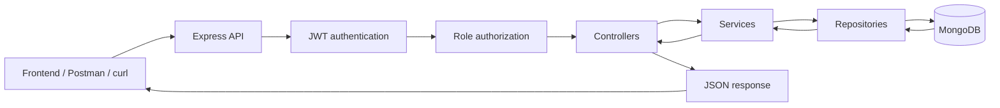

# Backend API Architecture

This diagram shows the complete request flow for every backend API.



## API groups

| Group | Base path | Purpose |
| --- | --- | --- |
| Health | `/health` | Check whether the server is running |
| Authentication | `/api/auth` | Register, login, current user, and logout |
| Products | `/api/product` | Create, view, update, and delete products |
| Suppliers | `/api/supplier` | Manage suppliers |
| Warehouses | `/api/warehouse` | Manage warehouses and warehouse status |
| Inventory | `/api/inventory` | Manage stock, adjustments, and low-stock items |
| Stock movements | `/api/stock-movements` | View inventory movement history |
| Purchase orders | `/api/purchase-orders` | Create and process purchase orders |
| Stock transfers | `/api/stock-transfers` | Request, approve, ship, receive, and cancel transfers |

## How to read the diagram

1. The frontend, Postman, or curl sends a request.
2. Express receives the request and selects the correct API route.
3. JWT authentication verifies the user token.
4. Role authorization checks the user's permission.
5. The controller receives the request.
6. The service applies business rules.
7. The repository reads or writes MongoDB.
8. The result travels back as a JSON response.

## Low-stock example

```text
GET /api/inventory/low-stock
```

The repository asks MongoDB for records where:

```text
availableQuantity <= reorderLevel
```

Only matching low-stock records are returned. The frontend does not download all inventory and calculate low stock itself.
